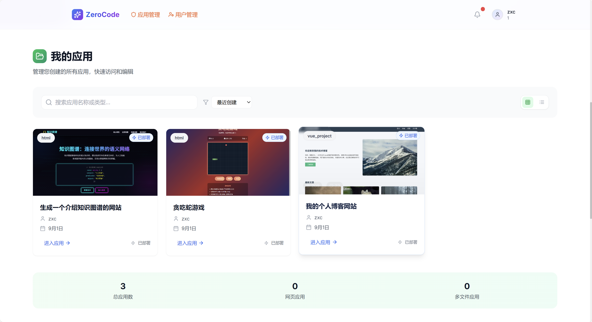
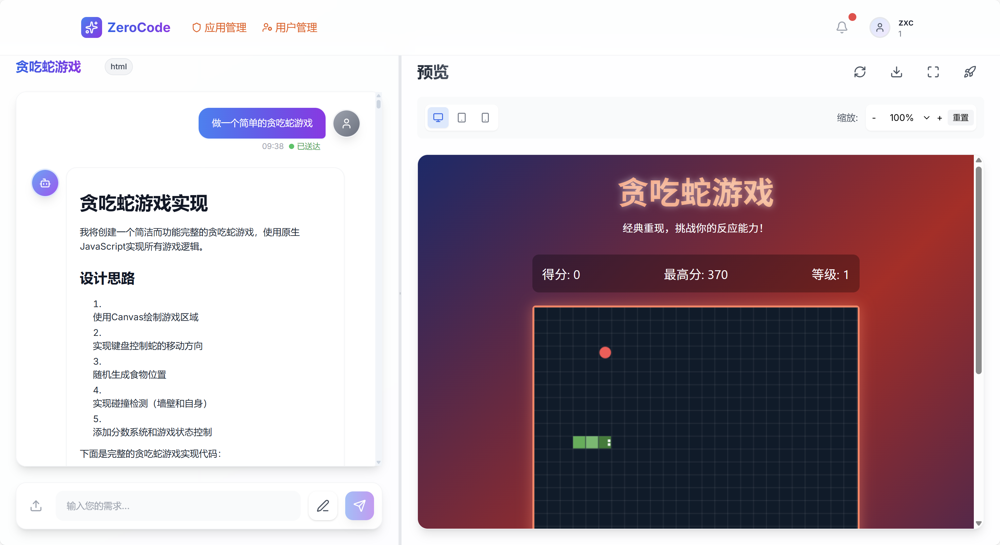
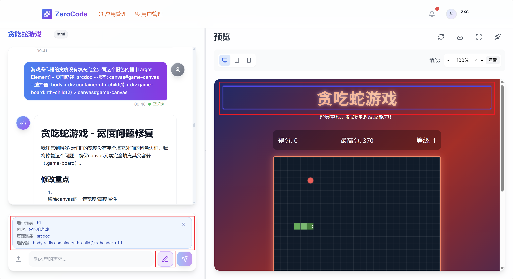

# ZeroCode - AI驱动的零代码前端开发平台

## 📖 项目简介

ZeroCode 是一个基于AI技术的零代码前端开发平台，旨在通过人工智能技术实现前端页面和后端代码的自动生成，极大提升开发效率，降低开发门槛。平台支持多种前端技术栈，提供流式输出、实时预览、项目下载等完整的开发体验。

## 🌟 展示
首页：

我的应用：

推荐应用：

应用实现：

可视化修改：



## ✨ 核心特性

### 🤖 AI代码生成
- **多种生成模式**：支持HTML单页面、多文件项目、Vue项目、React项目
- **智能提示词**：内置专业的系统提示词，确保生成代码质量
- **流式输出**：实时显示代码生成过程，提供良好的用户体验
- **代码质量检查**：AI自动检查生成代码的质量和规范性

### 🎯 技术栈支持
- **HTML/CSS/JS**：纯原生技术栈，无外部依赖
- **Vue 3**：现代化Vue项目脚手架
- **React 18**：基于Vite的React工程化项目
- **响应式设计**：自动生成适配移动端的响应式布局

### 🛠️ 平台功能
- **用户管理**：完整的用户注册、登录、权限控制系统
- **应用管理**：创建、编辑、删除、分享应用模板
- **对话记录**：保存AI对话历史，支持上下文连续对话
- **项目下载**：一键下载完整项目代码
- **实时截图**：自动生成项目预览截图
- **云存储**：集成腾讯云COS，支持文件上传下载

## 🏗️ 系统架构

### 技术选型
- **后端框架**：Spring Boot 3.5.4
- **数据库**：MySQL 8.0 + MyBatis-Flex 1.11.1
- **AI框架**：LangChain4j 1.1.0 + LangGraph4j 1.6.0
- **缓存**：Redis + Redisson 3.50.0 + Caffeine
- **文档**：Knife4j OpenAPI 4.4.0
- **工具库**：Hutool 5.8.38、Lombok 1.18.38
- **截图**：Selenium 4.33.0 + WebDriverManager 6.1.0

### 核心模块

```
src/main/java/com/zerocode/
├── ai/                     # AI服务模块
│   ├── aiservices/        # AI服务接口
│   ├── entity/            # AI实体类
│   ├── message/           # 消息处理
│   └── tool/              # AI工具
├── controller/            # REST API控制器
├── core/                  # 核心代码生成逻辑
│   ├── builder/          # 构建器
│   ├── parser/           # 解析器
│   └── saver/            # 保存器
├── langGraph4j/          # 工作流引擎
├── service/              # 业务逻辑层
├── config/               # 配置类
├── domain/               # 数据传输对象
├── utils/                # 工具类
└── resources/
    ├── prompt/           # AI提示词模板
    └── mapper/           # MyBatis映射文件
```

## 🚀 快速开始

### 环境要求
- **JDK**: 21+
- **Maven**: 3.6+
- **MySQL**: 8.0+
- **Redis**: 6.0+
- **Node.js**: 18+ (用于前端项目生成)

### 安装步骤

1. **克隆项目**
```bash
git clone https://github.com/your-username/zero-code.git
cd zero-code
```

2. **数据库初始化**
```bash
# 执行SQL脚本
mysql -u root -p < sql/table.sql
```

3. **配置文件**
```yaml
# 修改 src/main/resources/application.yml
spring:
  datasource:
    url: jdbc:mysql://localhost:3306/zero_code
    username: your_username
    password: your_password
  data:
    redis:
      host: localhost
      port: 6379
```

4. **构建运行**
```bash
# 编译项目
mvn clean package

# 启动应用
mvn spring-boot:run
```

5. **访问应用**
- API文档：http://localhost:8111/api/doc.html
- 应用接口：http://localhost:8111/api

## 📋 API接口

### 应用管理
- `POST /api/app/addApp` - 创建应用
- `GET /api/app/getAppById` - 获取应用详情
- `POST /api/app/list/my/app` - 获取我的应用
- `POST /api/app/updateApp` - 更新应用

### 工作流
- `POST /api/workflow/execute` - 同步执行工作流
- `GET /api/workflow/execute-flux` - 流式执行工作流

### 用户管理
- `POST /api/user/register` - 用户注册
- `POST /api/user/login` - 用户登录
- `GET /api/user/current` - 获取当前用户

## 🔧 配置说明

### AI模型配置
支持多种AI模型，在`config`目录下配置：
- DashScope（阿里云）
- DeepSeek
- OpenAI兼容接口

### 提示词模板
在`resources/prompt`目录下包含专业的提示词模板：
- `code-html-system-prompt.txt` - HTML页面生成
- `code-react-project-system-prompt.txt` - React项目生成
- `code-vue-project-system-prompt.txt` - Vue项目生成
- `code-quality-check-system-prompt.txt` - 代码质量检查

## 🎮 使用示例

### 生成HTML页面
```bash
curl -X POST "http://localhost:8111/api/workflow/execute" \
  -H "Content-Type: application/json" \
  -d '{"prompt": "帮我创建一个响应式的个人博客首页"}'
```

### 流式生成React项目
```bash
curl -N "http://localhost:8111/api/workflow/execute-flux?prompt=创建一个电商网站的React项目"
```

## 🧪 测试

```bash
# 运行所有测试
mvn test

# 运行特定测试
mvn test -Dtest=CodeGeneratorFacadeTest
```

## 📂 项目结构

```
zero-code/
├── src/
│   ├── main/
│   │   ├── java/           # Java源代码
│   │   └── resources/      # 配置文件和资源
│   └── test/               # 测试代码
├── sql/                    # 数据库脚本
├── pom.xml                # Maven配置
└── README.md              # 项目文档
```

## 🤝 贡献指南

1. Fork 项目
2. 创建功能分支 (`git checkout -b feature/AmazingFeature`)
3. 提交更改 (`git commit -m 'Add some AmazingFeature'`)
4. 推送到分支 (`git push origin feature/AmazingFeature`)
5. 开启 Pull Request

## 📄 开源协议

本项目采用 [MIT](LICENSE) 协议开源。

## 🙏 致谢

- [LangChain4j](https://github.com/langchain4j/langchain4j) - AI应用开发框架
- [Spring Boot](https://spring.io/projects/spring-boot) - 企业级应用框架
- [MyBatis-Flex](https://mybatis-flex.com/) - 数据库ORM框架
- [Knife4j](https://doc.xiaominfo.com/) - API文档工具


⭐ 如果这个项目对您有帮助，请不要忘记给它一个Star！